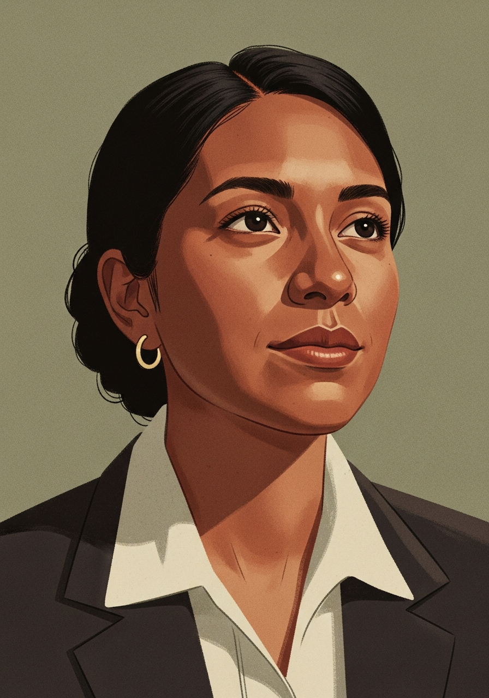
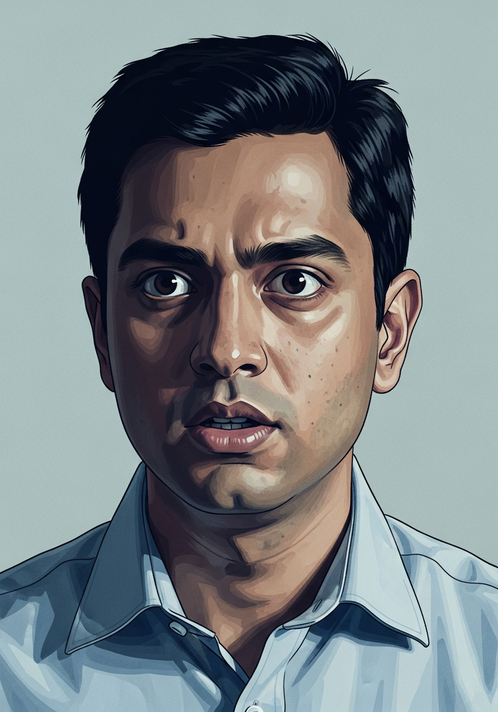
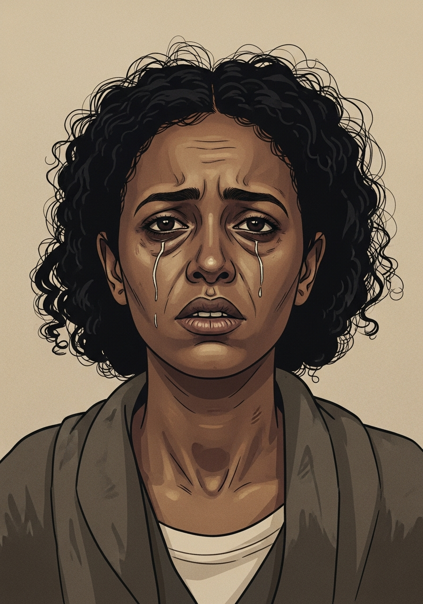
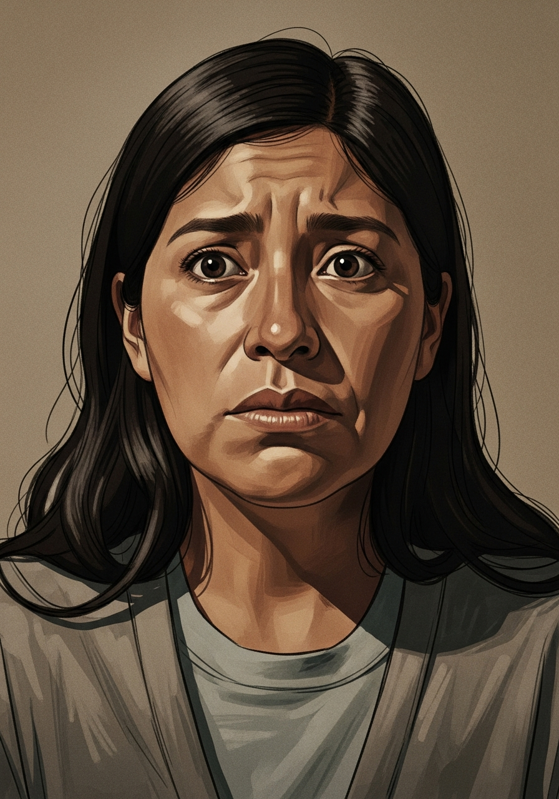

# Pending — A Life in the System

**Pending** is a browser-based life-simulation game that puts you inside the U.S. immigration system. You guide one of four characters through the system month by month — making decisions in branching story chains while juggling finances, relationships, stress, legal status, and the slow grind of forms and applications.

It's a game with a point: every mechanic maps to something real. Priority dates, the EB-2 backlog, RFEs, the public-charge rule, asylum work-permit waiting periods — the system you're fighting is modeled on the actual one, and an in-game glossary explains each concept as you hit it.

**▶ Play it live: [pending-game.vercel.app](https://pending-game.vercel.app)**


---

## The four lives you can play

| | Character | Status | The wait |
|---|---|---|---|
|  | **Maria Santos**, 28 · Mexico | DACA recipient, third-grade teacher | "I just want to stop being temporary." A $495 renewal every two years, forever. |
|  | **David Sharma**, 29 · India | H-1B software engineer | Did everything right — and the India EB-2 green-card backlog is ~40 years long. |
|  | **Fatima Haile**, 29 · Eritrea | Asylum seeker, journalist | Fled threats over her reporting. Hearing scheduled in 4–5 years. Can't work until then. |
|  | **Elena Morales**, 32 · Mexico | Undocumented | Married to a citizen, mother of two citizens — and still has no path. |

## What's under the hood

- **Deterministic simulation engine** (`src/engine/*`) — a seedrandom-based RNG, a condition evaluator, an outcome executor, and event/chain resolvers, so a given seed always plays out identically (which makes the gameplay testable).
- **~8.8k lines of hand-authored branching content** (`src/data/events/*`) — per-character event chains with conditions, consequences, and "legal traps" that fire when a player makes a plausible-but-costly mistake.
- **Systems modeled, not faked** — 16 real USCIS forms with processing/RFE lifecycles, a finance model, NPC relationships, a stress system, and status-transition rules.
- **Teaches as you play** — a 25-term glossary of real immigration concepts and 32 achievements tied to in-game milestones.
- **Bilingual content** (English / Spanish) served from versioned content bundles, with an offline-capable client fallback.
- **Fully client-side** — no backend required to play; content bundles ship with the app and are cached in IndexedDB.

## Stack

React 19 · TypeScript · Vite 7 · Tailwind CSS 3 · Radix UI · Zustand · Motion · Lottie · i18next · Zod
Tested with Vitest (unit) and Playwright + axe-core (e2e / accessibility).

## Run it locally

```bash
npm install
npm run dev          # start the Vite dev server
```

Then open the printed local URL.

Other useful scripts:

```bash
npm run build        # type-check + production build
npm run preview      # serve the production build
npm run lint         # eslint
npm run test         # vitest unit tests
npm run test:e2e     # playwright e2e + a11y
```

### Configuration (optional)

The app runs with zero configuration. To point it at a remote content API instead of the bundled content, copy `.env.example` to `.env` and set `VITE_API_BASE_URL`; if unset (the default), the app loads content bundles shipped in `public/content/`.

## Project layout

```text
src/
  engine/      deterministic simulation (RNG, conditions, outcomes, resolvers)
  data/        characters, events, forms, glossary, achievements, traps
  content/     content-bundle loader + Zod schema
  stores/      Zustand state (game, character, time, finance, events, forms…)
  components/  React UI on Radix primitives
  i18n/        localization
public/
  content/     published content bundles (en / es)
  images/      character portraits and scene art
```

## A note on intent

This is an educational project. It dramatizes the immigration system to make its mechanics legible — it is **not** legal advice, and the characters are fictional composites. The goal is to help people feel why "just get in line" isn't a real answer when, for some, the line is forty years long.
